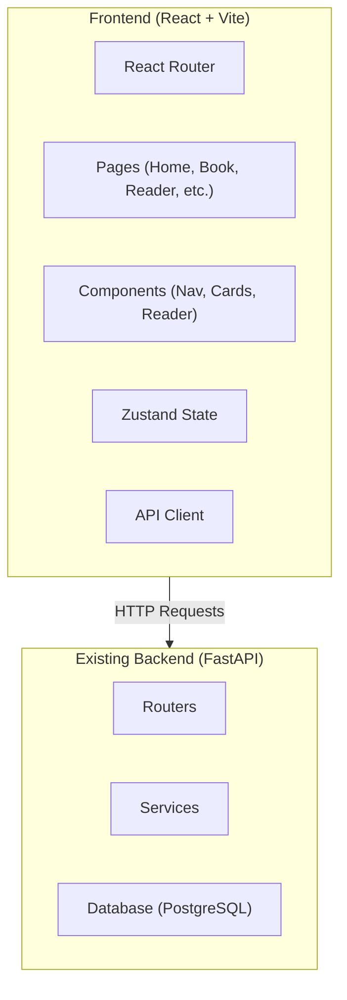

## 1. Architecture Design


## 2. Technology Description
- Frontend: React@18 + TypeScript + Vite + Tailwind CSS + Zustand
- Initialization Tool: vite-init
- Backend: Existing FastAPI backend (no changes)
- Database: Existing PostgreSQL database
- State Management: Zustand
- Routing: React Router DOM
- Icons: Lucide React

## 3. Route Definitions
| Route | Purpose |
|-------|---------|
| / | 首页，书籍展示、搜索 |
| /books/:bookId | 书籍详情页 |
| /books/:bookId/lectures/:lectureId | 阅读页 |
| /login | 登录页 |
| /profile | 个人中心 |
| /recharge | 充值页 |
| /upload | 上传页（管理员） |
| /admin | 后台管理 |

## 4. API Definitions
使用现有的 FastAPI 后端接口：
```typescript
// 书籍相关
interface Book {
  id: number;
  title: string;
  author: string;
  description: string;
  cover_image?: string;
  category: string;
}

interface Lecture {
  id: number;
  book_id: number;
  title: string;
  number: number;
}

interface Paragraph {
  id: number;
  lecture_id: number;
  original_text: string;
  translated_text?: string;
  order: number;
}

// API 客户端
const api = {
  getBooks: (): Promise<Book[]> => fetch('/api/books').then(r => r.json()),
  getBook: (id: number): Promise<Book> => fetch(`/api/books/${id}`).then(r => r.json()),
  getLectures: (bookId: number): Promise<Lecture[]> => fetch(`/api/books/${bookId}/lectures`).then(r => r.json()),
  getParagraphs: (lectureId: number): Promise<Paragraph[]> => fetch(`/api/lectures/${lectureId}/paragraphs`).then(r => r.json()),
  // 其他接口...
};
```

## 5. Server Architecture Diagram
使用现有的 FastAPI 后端架构，无需修改。

## 6. Data Model
使用现有的数据库模型，无需修改。
