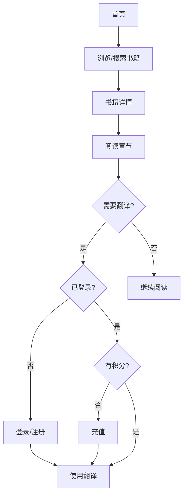

## 1. Product Overview
施泰纳著作库是一个在线阅读平台，提供鲁道夫·施泰纳（Rudolf Steiner）人智学著作的阅读、检索和翻译功能。
- 目标用户为对人智学感兴趣的读者、学者和研究人员
- 提供简洁时尚的阅读体验，支持多语种内容

## 2. Core Features

### 2.1 User Roles
| Role | Registration Method | Core Permissions |
|------|---------------------|------------------|
| Normal User | Email registration | 浏览、阅读书籍，搜索内容，基本翻译功能 |
| Premium User | 充值付费 | 完整翻译功能，离线下载，高级搜索 |
| Admin | 后台管理 | 书籍管理，用户管理，翻译管理 |

### 2.2 Feature Module
1. **首页**: 书籍展示、分类浏览、搜索功能
2. **书籍详情页**: 书籍信息、章节列表、阅读
3. **阅读页**: 正文阅读、翻译切换、段落导航
4. **登录/注册页**: 用户认证
5. **个人中心**: 个人信息、充值记录
6. **充值页**: 积分充值
7. **上传页**: 文档上传（管理员）
8. **后台管理**: 书籍、用户、翻译管理

### 2.3 Page Details
| Page Name | Module Name | Feature description |
|-----------|-------------|---------------------|
| 首页 | Hero区域 | 品牌介绍、快速导航 |
| 首页 | 书籍展示 | 分类视图、网格视图、搜索视图切换 |
| 阅读页 | 内容阅读 | 双语言对照、段落高亮、字体调整 |
| 搜索页 | 搜索功能 | 全文搜索、关键词高亮、结果筛选 |

## 3. Core Process
用户访问首页 → 浏览或搜索书籍 → 选择书籍 → 阅读章节内容 → （可选）使用翻译功能 → （如需高级功能）登录/充值

## 4. User Interface Design
### 4.1 Design Style
- 主色调：深靛蓝 (#1e3a8a)、暖米色 (#f8f5f0)
- 辅助色：柔和金 (#d4a574)、浅灰蓝 (#e0e7ff)
- 按钮风格：圆角矩形，微阴影，悬停有微妙缩放
- 字体：标题使用 Playfair Display（优雅衬线），正文使用 Source Sans Pro（现代无衬线）
- 布局风格：卡片式设计，充足留白，层次分明
- 图标风格：简洁线性图标，统一 stroke 宽度

### 4.2 Page Design Overview
| Page Name | Module Name | UI Elements |
|-----------|-------------|-------------|
| 首页 | Hero区域 | 大标题、优雅排版、柔和渐变背景 |
| 首页 | 书籍卡片 | 封面图、标题、作者、分类标签 |
| 阅读页 | 阅读容器 | 最大宽度限制、舒适行高、双栏布局 |
| 导航栏 | 顶部导航 | 半透明背景、滚动时变化 |

### 4.3 Responsiveness
- Desktop-first 设计
- 移动端适配：断点 768px、1024px
- 触摸优化：足够的点击区域，流畅的滚动

### 4.4 3D Scene Guidance
不适用 3D 场景
